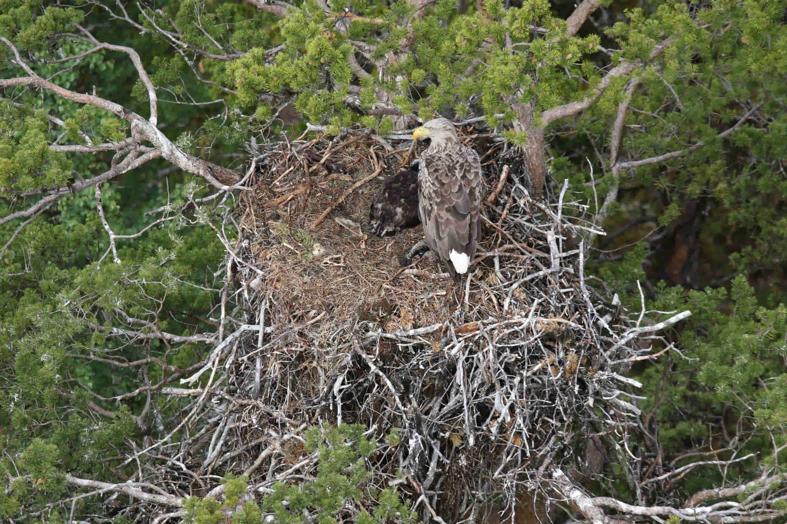

# Bakgrund
Havsörn har inventerats årligen i Sverige sedan 1964. Sedan 1989 ingår den del av beståndet som häckar vid kust och hav i den Nationella Miljövervakningen.

# Utbredning och förekomst
xxx

# Uppskattning av antal par
yyy

# Inventeringsresultat

## Rapport för 2021-2023
Test

# Ringmärkning

# Boplatser
<!-- {width=45%} {width=45%} -->

```{r image_grobs, fig.show = "hold", out.width = "40%", fig.align = "default", fig.cap='Två **havsörnsbon** i Lappland', echo = TRUE}


```

```{r echo = TRUE}
images = paste0('images/haorn-bo-', 1:2, '.jpg')
images_hi_res = paste0('images/haorn-bo-', 1:2, '-220-dpi.jpg')
images_caps <- c("A", "B")
```

```{r, out.width = "40%", fig.link = images_hi_res, fig_show = "hold", fig.cap = "A", fig.align = "default", echo = TRUE}
knitr::include_graphics(images)
```

<div class = "row">
  
<div class = "col-md-6">
<br><br>Since R Markdown use the [bootstrap framework](https://getbootstrap.com/docs/4.0/layout/grid/) under the hood. It is possible to benefit its powerful grid system. Basically, you can consider that your row is divided in 12 subunits of same width. You can then choose to use only a few of this subunits.
</div>

<div class = "col-md-6">
```{r, message = FALSE, echo = FALSE, fig.cap = '**Havsörnsbo** vid Piteälven i Lappland', fig.link = "images/haorn-bo-1-220-dpi.jpg"}

```
</div>
</div>